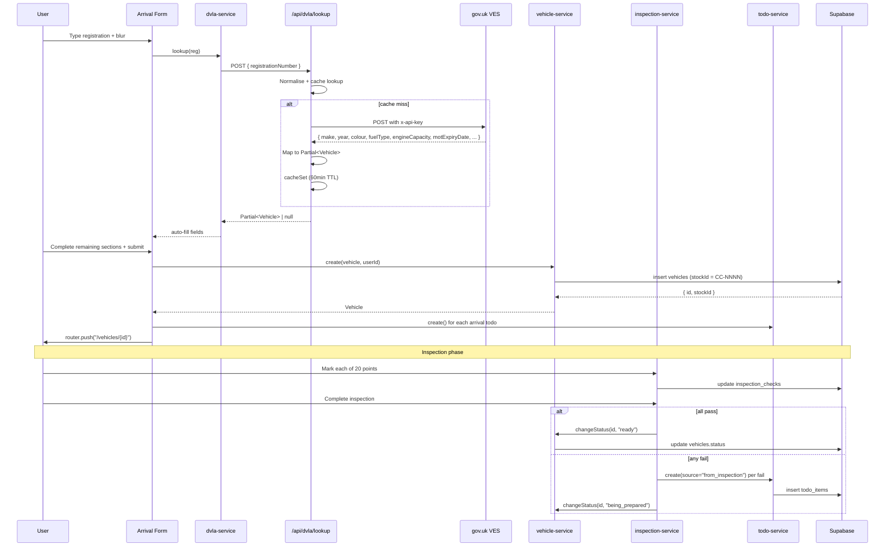

# Flow: Adding a vehicle

> **Audience:** users + developers + AI agents
> **Modules touched:** Inventory, Maintenance (Inspection)
> **Permissions:** `vehicle:create`, `inspection:start`, `inspection:complete`, `todo:create`

## Trigger

A vehicle has arrived at the yard. The buyer (typically the owner or inventory manager) wants to log it into the system so it can be inspected, prepped, and eventually listed for sale.

## Outcome

A `Vehicle` row exists in Supabase with a permanent `stockId` (e.g. `CC-0115`). The vehicle's status walks through `received` → `inspection_pending` → `being_prepared` → `ready` as work completes. Things-to-Do may have been added from the arrival form or auto-created by inspection failures.

## Steps

1. **Login** — open `/login`, sign in via Supabase auth. Land on `/dashboard`.
2. **Open arrival form** — sidebar → Inventory → Add Vehicle. Lands on `/inventory/add-vehicle`.
3. **Type the registration** — into the Registration field. On blur, the form fires `dvlaService.lookup()` against `/api/dvla/lookup`.
4. **DVLA auto-fill** — make, year, colour, fuel type, engine size, MOT expiry populate from gov.uk. Model is **always** null (DVLA doesn't return it); user enters it manually.
5. **Complete the 7 form sections** — Identity, Source/Seller, Documentation, Costs, Receiving, Things to Do (optional), Pricing (optional). The sticky Cost Summary panel on the right updates live as buying price + fees + transport are typed in.
6. **Submit** — form calls `vehicleService.create()`. A new row is inserted; `stockId` is generated from `Company.nextStockSeq`. Any arrival-form Things to Do are persisted via `todoService.create({ source: "manual" })`.
7. **Land on the detail page** — `router.push("/vehicles/{id}")`. The 8-tab vehicle file is now visible.
8. **Start inspection** — Inspection tab (or `/vehicles/[id]/inspection`). 20 pass/fail toggles plus free-text notes.
9. **Complete inspection** — if all 20 pass, `vehicleService.changeStatus("ready")` runs. If any fail, `todoService.create({ source: "from_inspection" })` fires for each failed point with a default cost.
10. **Things-to-Do work happens** — mechanics complete their assigned items. Each `done` transition rolls cost into `Vehicle.valueAddition`. When the list is empty, the inventory manager flips status to `ready`.

## Sequence diagram

## Files in the chain

| Step | File | Role |
|---|---|---|
| Login | `src/app/(auth)/login/page.tsx` | Auth UI |
| Auth state | `src/contexts/auth-context.tsx` | Hydrates `user` + `company` |
| Shell | `src/app/(dashboard)/layout.tsx` | Renders sidebar + header |
| Arrival form | `src/components/vehicles/arrival-form.tsx` | The 7-section form |
| DVLA proxy | `src/app/api/dvla/lookup/route.ts` | Server-side DVLA call + cache |
| DVLA service | `src/lib/services/dvla-service.ts` | Client-side caller; non-throwing |
| Vehicle service | `src/lib/services/vehicle-service.ts` | Insert + status transitions |
| Inspection page | `src/app/(dashboard)/vehicles/[id]/inspection/page.tsx` | Checklist UI |
| Inspection components | `src/components/vehicles/inspection-checklist.tsx` | 20-point toggles |
| Inspection service | `src/lib/services/inspection-service.ts` | Per-point updates |
| Todo service | `src/lib/services/todo-service.ts` | Auto-create from fails |
| Activity service | `src/lib/services/activity-service.ts` | Audit log of every transition |

## Permissions required

| Step | Capability |
|---|---|
| Open Add Vehicle | `vehicle:create` |
| Submit | `vehicle:create` |
| Start inspection | `inspection:start` |
| Complete inspection | `inspection:complete` |
| Mark a Thing-to-Do done | `todo:complete` |
| Change status manually | `vehicle:status:change` |

## What can go wrong

| Problem | What happens | Fix |
|---|---|---|
| DVLA returns 400 (invalid format) | `dvla-service` returns `null` silently; form shows "Manual entry required" inline state | User fills fields manually |
| DVLA rate-limited (429) | Same — `null` + console.warn | Try again later or fill manually |
| DVLA upstream unreachable | Service falls back to `DVLA_MOCK` in `dvla-service.ts` if the reg is seeded there | Demos keep working |
| Duplicate registration on submit | `vehicleService.getByRegistration` returns existing; user gets a JS `confirm` "Add anyway?" | Returned/removed vehicles can come back — duplicate is allowed |
| Inspection failure with no obvious owner | Things-to-Do auto-create with `vendorId: null` and `cost: null` | User assigns vendor and sets cost manually |
| Network drop during submit | Form throws; toast shows error; no row inserted | User retries |
| `stockId` collision (extremely rare) | DB constraint fails; service throws | Manual fix — check `Company.nextStockSeq` |
