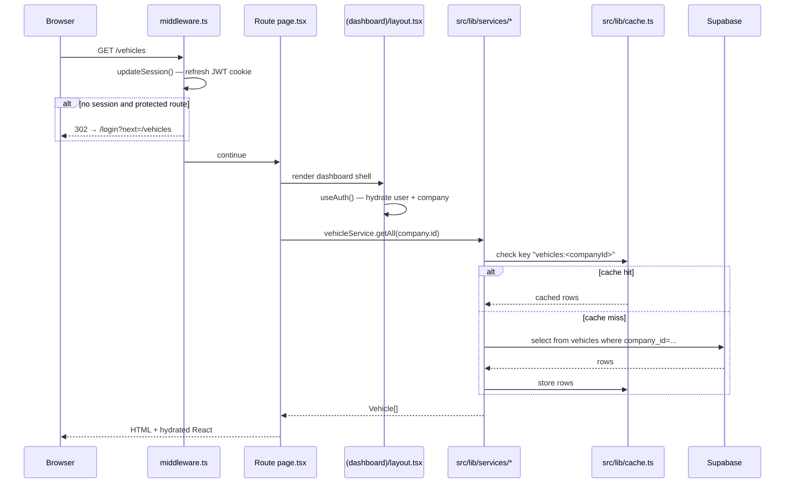

# Architecture

> **Audience:** developers + AI agents
> **Last verified against `main` HEAD:** `86f9d91`

## Stack

| Layer | Technology |
|---|---|
| Framework | Next.js 16.2.4 (App Router, Turbopack dev, Node runtime for API routes) |
| Language | TypeScript (strict) |
| UI library | React 19 |
| Styling | Tailwind v4 (`@theme inline` block in `src/app/globals.css`) |
| Components | shadcn/ui primitives + custom domain components |
| Forms | react-hook-form + zod resolvers |
| Toasts | sonner |
| PDFs | `@react-pdf/renderer` 4.5.1 |
| Charts | recharts (one card on dashboard) |
| Database | Supabase Postgres (single project) |
| Auth | Supabase Auth (email/password, JWT cookies) |
| Storage | Supabase Storage (vehicle photos) |
| AI image gen | OpenAI Images API (proxied) |
| Vehicle lookup | DVLA Vehicle Enquiry Service v1 (proxied) |
| Hosting | Vercel (Next.js zero-config; Fluid Compute) |
| Analytics | Vercel Speed Insights + Analytics (`@vercel/*`, active on Vercel) |

## App layout

```
src/app/
├── (auth)/                          # Auth-only routes — no sidebar, no shell
│   ├── login/page.tsx
│   ├── forgot-password/page.tsx
│   └── reset-password/page.tsx
├── (dashboard)/                     # Authenticated app — shell + sidebar
│   ├── layout.tsx                   # 2×2 grid: sidebar + header + main
│   ├── dashboard/
│   ├── vehicles/
│   ├── inventory/add-vehicle/
│   ├── maintenance/
│   ├── advert/
│   ├── sales/
│   ├── warranties/
│   └── admin/
└── api/                             # Server-side API routes
    ├── dvla/lookup/route.ts         # DVLA proxy + LRU cache
    ├── photo/generate/route.ts      # OpenAI image proxy
    └── photo/vehicle/route.ts       # Supabase Storage helper
```

The `(auth)` and `(dashboard)` parens are Next.js route groups — they organise files without affecting URLs.

## Request lifecycle



## Environment variables

| Variable | Required | Where | Purpose |
|---|---|---|---|
| `NEXT_PUBLIC_SUPABASE_URL` | yes | browser + server | Supabase project endpoint |
| `NEXT_PUBLIC_SUPABASE_PUBLISHABLE_KEY` | one of these two | browser + server | Modern publishable key (`sb_publishable_…`) |
| `NEXT_PUBLIC_SUPABASE_ANON_KEY` | one of these two | browser + server | Legacy anon JWT key (accepted for compatibility) |
| `SUPABASE_SERVICE_ROLE_KEY` | seeding only | server-only | Privileged Postgres ops — never reaches browser |
| `DVLA_API_KEY` | yes | server-only (`/api/dvla/lookup`) | DVLA Vehicle Enquiry Service v1 |
| `OPENAI_API_KEY` | yes | server-only (`/api/photo/generate`) | Image generation for photo processing |

Local: `.env.local` (gitignored via `.env*`). Production: Vercel project Environment Variables (set all the above in Vercel → Project Settings → Environment Variables, or push them with `vercel env`).

Auth context (`src/contexts/auth-context.tsx`) reads the URL + publishable key on init; if either is missing it short-circuits to a "Can't connect" screen rendered by `(dashboard)/layout.tsx`.

## Directory map (top-level only)

| Path | Owns |
|---|---|
| `src/app/(auth)/` | Login + password reset pages (no shell) |
| `src/app/(dashboard)/` | All authenticated routes + the shell layout |
| `src/app/api/` | Server-side API route handlers |
| `src/components/ui/` | shadcn primitives (Card, Button, Dialog, etc.) — minimally customised |
| `src/components/layout/` | App shell: sidebar, header, sidebar-config |
| `src/components/shared/` | Cross-module utility components (RegPlate, BigCalendar, EmptyState…) |
| `src/components/dashboard/` | Dashboard-specific widgets (KPI tiles, Recent Deals, Calendar card…) |
| `src/components/vehicles/` | Vehicle module forms + detail tabs |
| `src/components/sales/` | Sales pipeline + lead/deal components |
| `src/components/maintenance/` | Maintenance job board + workshop |
| `src/components/warranties/` | Warranty tables, KPIs, dialogs |
| `src/components/enquiries/` | Add-Enquiry dialog stack (customer-first dedup) |
| `src/components/pdf/` | `@react-pdf/renderer` templates |
| `src/lib/services/` | 24 domain services — one per entity |
| `src/lib/supabase/` | Client factories (browser, server, admin, middleware) |
| `src/lib/` | `types.ts`, `capabilities.ts`, `roles.ts`, `cache.ts`, `vat.ts`, `utils.ts`, `elevated.tsx`, `surface-*.ts(x)`, `formatters.ts`, `constants.ts`, `enquiry-constants.ts`, `cache-warmup.ts`, `toast.ts` |
| `src/hooks/` | `use-permissions`, `use-customer-search`, `use-postcode-lookup`, `use-realtime-table`, `use-mobile` |
| `src/contexts/` | `auth-context`, `sidebar-state-context` |
| `middleware.ts` | Root middleware — Supabase session refresh on every request |
| `scripts/` | Tooling: Polaris theme build, master-sheet import, demo-vehicle seed, lint ratchet |
| `docs/` | This documentation tree |

## Service-layer contract

Every file in `src/lib/services/*.ts` follows the same shape:

```typescript
export const fooService = {
  async getAll(companyId: string): Promise<Foo[]> { … },
  async getById(id: string): Promise<Foo | null> { … },
  async create(input: NewFoo, actorUserId: string): Promise<Foo> { … },
  async update(id: string, patch: Partial<Foo>, actorUserId: string): Promise<Foo> { … },
}
```

All methods:
- Cache via `cacheGet` / `cacheSet` in `src/lib/cache.ts`, keyed by entity + filter.
- Invalidate the entity's cache key on every write.
- Throw `Error` (not return error tuples) on Supabase failures.
- Log write events to `activity_log` where the schema requires audit trail.

See [`services.md`](./services.md) for the full index.

## Caching + realtime

Caching is in-process memory (Map). Cleared on tab reload. Refreshed by:

1. Explicit invalidation in service write methods.
2. `useRealtimeTable('<table>', callback)` subscribers — when Supabase notifies of an `INSERT` / `UPDATE` / `DELETE`, the hook invalidates the cache and reruns the callback.

This combination keeps multi-user dashboards in sync without polling.

## Building & running

| Command | Purpose |
|---|---|
| `pnpm dev` | Turbopack dev server on `:3000` |
| `pnpm build` | Production build |
| `pnpm lint` | ESLint |
| `pnpm tsc --noEmit` | Type-check |
